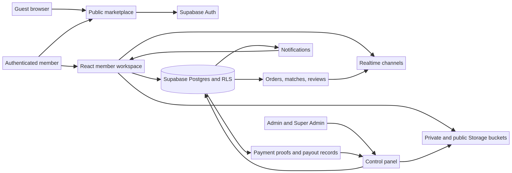
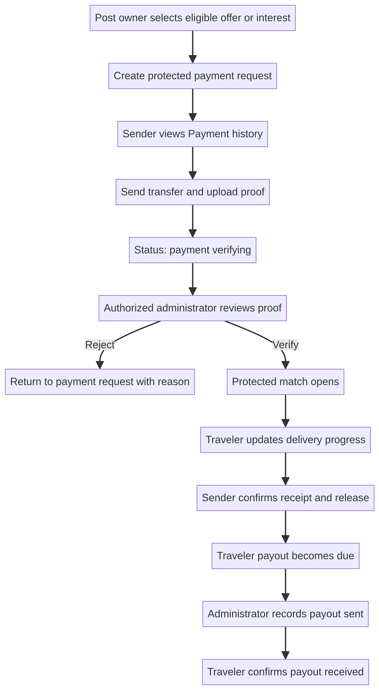
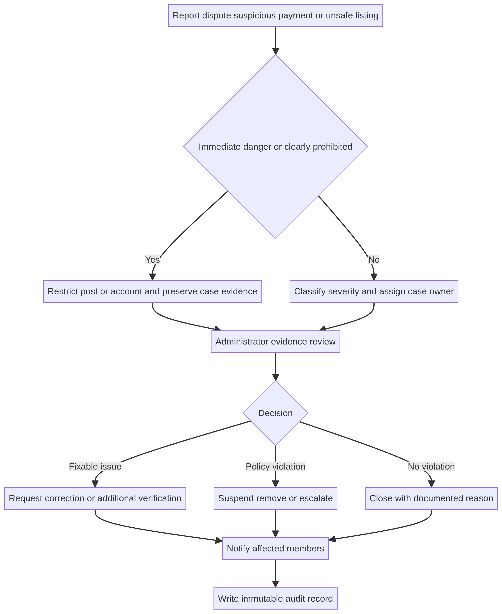

# BridgeX Developer Manual — Core Edition

**Repository:** `abdullahbinfahad/BridgeX`  
**Primary web app:** `apps/web`  
**Database:** Supabase Postgres, Auth, Realtime, and Storage  
**Audience:** Developers, administrators, support operators, and release managers  
**Document status:** Core manual with a structured 600-page publication plan

> **Use this manual as an engineering map, not as authority to override database policies.** Sensitive data, document access, payment evidence, roles, and matching rules must be changed through reviewed migrations and least-privilege policies.

## 1. System intent

BridgeX is a peer-to-peer global goods-carrying marketplace. Its job is to let senders find travelers with capacity and let travelers discover legitimate item-delivery needs. The core design rule is **public discovery, protected execution**. Public users can browse. Signed-in members can post or respond. Contact details, exact addresses, payment proof, payout details, and direct deal chat become available only through the protected state flow.

### 1.1 Non-negotiable product claims

Do not describe BridgeX as a bank, licensed escrow provider, customs broker, airline, freight forwarder, or legal adviser unless a later verified integration and legal review make that claim true. The current payment design is a manually reviewed payment-proof workflow. The user remains responsible for item accuracy and compliance with applicable customs, carrier, airline, import/export, and destination rules.

### 1.2 Core ownership model

| Role | Core abilities | Must not be able to do |
|---|---|---|
| Guest | Browse public posts and public profiles | Post, respond, view protected details, message members, view documents or payment details |
| Member | Create posts, respond, manage own account, view own protected deals, submit proof, report issues | View another member’s private documents, unrestricted messages, or administrator queues |
| Verified member | Same as member with verified trust signal | Treat verification as legal/customs/financial approval |
| Administrator | Review verification, payment proof, reports, orders, support and permitted chats | See or recover user passwords; act outside documented audit scope |
| Super Admin | Manage administrator governance and platform policies | Read passwords or bypass data minimisation without an authorized operational reason |

## 2. Repository map

| Location | Responsibility | Typical change |
|---|---|---|
| `apps/web/client/src/App.tsx` | Client routes and guards | Register a new member or admin page |
| `apps/web/client/src/components/bridgex/PublicLayout.tsx` | Header, member shortcut menu, unread notification routing | Add a new notification destination or menu shortcut |
| `apps/web/client/src/components/DashboardLayout.tsx` | Member workspace sidebar | Add workspace pages such as Payment history |
| `apps/web/client/src/pages/Workspace.tsx` | Orders, offers, interests, completed-order release, member workspace panels | Repair member state displays and in-app workflows |
| `apps/web/client/src/pages/PaymentHistory.tsx` | Payment records, proof submission, traveler payout details and payouts | Change payment UI without exposing sensitive data |
| `apps/web/client/src/pages/AdminControl.tsx` | Administrative queues | Add filtered queues, not unscoped raw data views |
| `apps/web/client/src/pages/AdminPaymentReview.tsx` | Payment proof review | Keep administrator decisions auditable |
| `apps/web/client/src/pages/ReviewsPage.tsx` | Completed-order feedback | Enforce one review per eligible completed order |
| `apps/web/server/*.test.ts` | Regression coverage | Add a test whenever a state machine, RLS contract, or client safety rule changes |
| `supabase/migrations/*.sql` | Schema, RPCs, RLS, trigger logic, storage buckets | Add forward-only migrations; never edit applied migrations |

## 3. Data and privacy architecture

BridgeX uses Supabase Auth for identities, Postgres for domain records, Realtime for selected live updates, and Storage for images, documents, proof screenshots, and private payout assets. Postgres is the source of truth for permissions and state; storage objects must always be paired with scoped policies and a record that defines who may request a signed URL.

### 3.1 Sensitive storage classes

| Class | Examples | Access rule |
|---|---|---|
| Public post media | Request/listing media shown on public cards or details | Public only when tied to an open public post |
| Private verification evidence | National ID, passport, eligible student ID | Owner and authorized reviewers only; never public profile data |
| Private payment evidence | Uploaded transfer screenshot | Payer and authorized payment reviewers only |
| Private payment instructions | Platform payment QR asset | Only a member with an active payment request and authorized reviewers |
| Private traveler payout asset | Traveler QR or bank instruction reference | Traveler and authorized payout reviewers only |

### 3.2 Data access rule

Do not obtain a signed URL simply because a person knows an object path. First authorize against the related database record. The record should express: owner, lifecycle state, required role, reviewer eligibility, and reason for access. The browser should never receive a general service key.

## 4. User journey state machines

### 4.1 Sender request → traveler offer

1. A sender publishes an open request with route, item/service details, categories, weight, timing, handling, delivery information, and legal declaration.
2. A traveler submits an offer.
3. The sender reviews responses in the protected workspace.
4. The sender selects a response, creating a payment request in `pending_payment`.
5. The sender submits payment proof. Status becomes `payment_verifying`.
6. An administrator verifies or rejects the proof.
7. Verification opens a protected match; matched details and chat become available.
8. The traveler updates fulfillment; the sender confirms receipt and releases when delivered.
9. The order remains in completed history while original public media can be cleaned up according to the workflow.

### 4.2 Carry listing → sender interest

1. A traveler publishes capacity, route, departure and estimated delivery dates, accepted categories, transport details, capacity, and price.
2. A sender submits an interest with category, quantities, weight, delivery requirement, and destination contact details.
3. The traveler selects an eligible interest. The payment request belongs to the sender and updates the carry listing to payment pending.
4. During payment verification, capacity is reserved rather than immediately consumed permanently.
5. Once proof is verified, the protected match opens and reserved capacity becomes a confirmed obligation.
6. Multiple interests may proceed until remaining capacity is exhausted. Do not introduce a unique per-listing/per-sender constraint unless product policy says only one interest per sender is allowed.

### 4.3 Order-release → traveler payout

1. A traveler supplies a private payout method before marking a protected order Delivered.
2. The sender confirms receipt and releases the order.
3. The release RPC creates a traveler payout due record and an administrator notification.
4. An authorized administrator checks the payout instruction and records payment sent.
5. The traveler confirms receipt. This closes the payout record while preserving audit history.

## 5. Payment workflow implementation guide

### 5.1 Important payment states

| State | Meaning | Allowed next action |
|---|---|---|
| `pending_payment` | Protected acceptance has started; evidence is still required | Submit proof or cancel/reject under policy |
| `payment_verifying` | Member submitted proof; administrator review is required | Verify or reject proof |
| `verified` | Proof decision succeeded and match opened | Manage protected order |
| `rejected` | Proof could not be accepted | Present clear reason and allow policy-approved retry |
| `payment_due` | Released order created a traveler payout obligation | Administrator reviews payout instruction |
| `payment_sent` | Administrator recorded external payout execution | Traveler confirms receipt |
| `payment_received` | Traveler confirmed receipt | Retain immutable history |

### 5.2 Adding a new payment status safely

1. Inspect every table constraint that carries the state: response table, request/listing table, payment record, match/order, and notifications.
2. Add a new forward-only SQL migration. Never alter the historical migration used in production.
3. Update RPC checks and any trigger that sets the new status.
4. Update TypeScript unions, label/tone helpers, workspace filters, admin queues, and notification destinations.
5. Add regression tests that assert both the migration text and user-facing state surface.
6. Apply the migration, verify the live constraint, run type check, tests, and production build.

### 5.3 Troubleshooting checklist: payment request fails

| Symptom | Likely cause | First inspection | Safe corrective action |
|---|---|---|---|
| `offers_status_check` error | Offer constraint lacks payment state | `offers` constraint in live database and latest migration | Add allowed payment states through a new migration |
| `listing_interests_status_check` error | Carry-interest constraint lacks payment state | `listing_interests` constraint | Add payment state through migration and test |
| `send_requests_status_check` error | Request workflow tries `payment_pending` but request constraint is older | `send_requests` constraint | Extend only the needed values |
| `carry_listings_status_check` error | Listing workflow tries `payment_pending` but listing constraint is older | `carry_listings` constraint | Extend only the needed values |
| QR image cannot load | RLS is too broad/too narrow or signed URL creation is skipped | Payment record, storage policy, signed URL code | Scope to active payment record; never make private bucket public |
| Verification opens no match | Admin RPC or proof status did not complete | Payment proof record, verifier RPC result, match tables | Check transaction logic and explicit error; do not manually expose contact info |

## 6. Notifications and realtime updates

The account menu classifies unread records into **Profile**, **Workspace**, **Messages**, **Payment history**, and **Admin control panel**. Every notification should have a stable type, title, body, link, recipient, actor where applicable, related record ID, creation time, and read time.

### 6.1 Payment notification rules

| Event | Primary recipient | Primary destination | Permanent record |
|---|---|---|---|
| Proof submitted | Administrator | Payment verification queue | Admin notification and review record |
| Payment verified for a sender request | Sender | Payment history | Payment record, match/chat, message update |
| Payment verified for carry-space interest | Traveler | Payment history | Payment record, match/chat, message update |
| Traveler payout due | Administrator | Traveler payout queue | Payout record and admin notification |
| Payout sent | Traveler | Payment history | Payout record and payment notification |
| Payout received | Administrator | Traveler payout queue/history | Payout record and audit event |

### 6.2 Debugging notification issues

Inspect in order: notification table insert; RLS policy for the intended recipient; correct `user_id`; notification `type` classification in `PublicLayout`; link target; polling/realtime channel; client read-state transition. Do not “fix” a notification failure by giving members broad select access to every notification.

## 7. Reviews, reports, and trust signals

Reviews are eligible only after an order is completed/released. The review UI must let a member select one to five stars and add an optional factual comment. A write should reject duplicate reviews for the same order/reviewer and should display the database error safely if policy rejects it.

Review averages are community signals, not guarantees. Retain `0.0 (0)` for a member with no reviews to avoid falsely implying quality. Add later operational controls for suspicious review concentration, report-linked review monitoring, and an appeals process.

## 8. Administrator operations manual

### 8.1 Verification review

An administrator should review a person record rather than a loose list of isolated documents. The person record should show the member’s supplied identity information, each required document, submission status, and a clear approve/reject reason. A rejection must notify the member and state what may be corrected without exposing sensitive internal criteria.

### 8.2 Payment proof review

Confirm that the payment record exists, the proof belongs to the payer, the required amount/currency align with the request, and the proof is legible. If verification cannot be confirmed, reject with a concise reason and preserve the review record. Do not release contact details or open the match outside the verifier RPC.

### 8.3 Incident response

An administrator must distinguish ordinary support questions from safety reports, payment disputes, prohibited-item claims, and immediate danger. For a critical allegation, preserve relevant evidence references and restrict access only according to documented policy. Do not make legal conclusions inside the chat. If platform policy or law requires external reporting, record the authority, timestamp, legal basis, and material disclosed.

## 9. Development procedure

### 9.1 Standard change checklist

1. Add the user-visible change to `apps/web/todo.md` as an unchecked item.
2. Read the relevant page, component, tests, and migration history before editing.
3. Make the smallest coherent UI/database change.
4. Add or update a Vitest regression test.
5. Run `pnpm check`, `pnpm test`, and `pnpm build` inside `apps/web`.
6. Review `todo.md`, mark the item complete, then commit and push the source and migration together.
7. Confirm production state for user-critical workflows after deploy.

### 9.2 Database migration policy

All schema, RLS, trigger, constraint, RPC, and storage-policy changes are append-only migrations under `supabase/migrations`. Use descriptive time-based filenames. Apply migrations once through the approved Supabase workflow, then commit the exact source file. A migration that was applied but not committed is a release risk because a new environment will not reproduce the live database.

### 9.3 Testing policy

The current suite combines feature/regression source assertions and business-rule tests. Expand it when changing payment, capacity, release, notification routing, verification, or role behavior. Source-string tests alone are not enough for mature operations; future work should add integration tests against an isolated Supabase project and browser smoke tests for guest, member, admin, and super-admin journeys.

## 10. Common support problems and safe response

| User report | Safe support response | Technical escalation |
|---|---|---|
| “I cannot post” | Ask for the exact validation/error text and whether media was included | Check form state, upload result, and `send_requests`/`carry_listings` RLS or constraint |
| “Accept & pay failed” | Do not ask for payment credentials; request the visible error/reference | Check response/request/listing payment-state constraints and `start_bridgex_payment` result |
| “My proof is still verifying” | Explain that an authorized review is pending; do not promise timing | Check proof state, assignment, reviewer decision, and notification record |
| “I cannot see my messages” | Confirm which deal/support conversation and unread state | Check match participant RLS, message query, and realtime subscription |
| “I need my password” | Send a reset link; never view or request the old password | Use the recovery flow and audit it |
| “The traveler has not been paid” | Check Payment history and payout record | Check sender release, payout instruction, queue status, and payment-sent record |

## 11. Security and release gates

Before production release, verify: RLS behavior for the new table/bucket; no public storage exposure of private assets; no secret in client bundle; no password exposure; administrator role guard; signed URLs restricted by active record; error UI does not leak internals; production build passes; unit tests pass; and key paths are smoke-tested as guest/member/admin.

For changes that affect money, documents, private addresses, or account restrictions, use a second reviewer and retain the decision context. The fastest implementation is not always the safest implementation.

## 12. 600-page documentation publication plan

The following plan turns this core edition into a genuine long-form illustrated manual without filling pages with duplicate text. Each volume should have screenshots or diagrams for every major procedure, source references, revision history, and practical exercises.

| Volume | Pages | Content |
|---|---:|---|
| I. Product and domain foundation | 60 | Marketplace model, user journeys, terminology, policy boundaries, route/item examples |
| II. Frontend architecture | 80 | React routes, layouts, hooks, forms, visual patterns, accessibility, error-state examples |
| III. Supabase data model | 100 | Tables, state diagrams, RLS reasoning, RPC contracts, storage buckets, migration history |
| IV. Payments and payouts | 80 | Proof review, fee ledger, payout due, reconciliation, disputes, fraud cases, sample audit records |
| V. Messaging, notifications, and reviews | 60 | Conversation permissions, realtime, unread states, review eligibility, report workflow |
| VI. Administration and support | 60 | Verification, payment review, queues, decision templates, support playbooks, escalation |
| VII. Mobile, deployment, and observability | 60 | Android wrapper/native path, Render, domains, monitoring, release runbooks, rollback |
| VIII. Troubleshooting and security appendices | 100 | Error catalogue, incident response, privacy retention, QA cases, glossary, screenshots |
| **Total planned publication** | **600** | **A non-duplicative, image-rich developer manual series** |

## References

[1]: [BridgeX Product Audit and Improvement Priorities](BridgeX_Product_Audit.md)

[2]: [BridgeX Research Paper](BridgeX_Research_Paper.md)

[3]: [General Administration of Customs of the People’s Republic of China, Customs Clearance Guide for International Passengers](http://english.customs.gov.cn/statics/88707c1e-aa4e-40ca-a968-bdbdbb565e4f.html)
