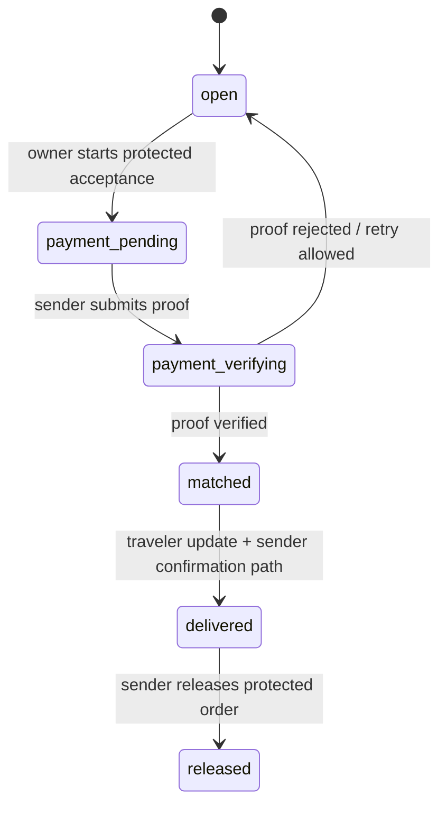

# BridgeX Developer Operations Handbook

**Edition:** 1.0 — Operations Reference  
**Repository:** `abdullahbinfahad/BridgeX`  
**Primary public service:** [bridgex.abdullahbinfahad.info](https://bridgex.abdullahbinfahad.info/)  
**Primary stack:** React, Vite, Supabase Auth/Postgres/Storage/Realtime, Expo Android WebView, Render  
**Audience:** Engineers, administrators, support operators, moderators, release managers, and security reviewers  

> **Operating principle:** BridgeX is a public-discovery and protected-execution marketplace. Browsing is public; private identity documents, exact addresses, payment evidence, payout details, protected messages, and administrative decision records must remain available only to people whose role and lifecycle state justify access.


## Contents

| Part | Scope |
|---|---|
| I | Product boundary, repository map, roles, and route model |
| II | Data, storage, access control, and lifecycle state machines |
| III | Request, listing, offer, interest, match, payment, payout, and review operations |
| IV | Messaging, notifications, administration, support, and incident operations |
| V | Android, Google Play, Render, testing, release, rollback, and troubleshooting |
| VI | Change-control templates, migration map, and operational checklists |

---

# Part I — Foundation

## 1. Product boundary and truthful claims

BridgeX connects senders who need goods carried with travelers who have luggage or cargo capacity. It supports worldwide routes while presenting a China-first marketplace experience. A member can publish an item request or a carry listing, compare qualified responses, complete a protected payment-evidence step, and then receive the counterpart details and protected chat only after the authorized workflow opens a match.

BridgeX must **not** be described as a bank, licensed escrow provider, customs broker, carrier, airline, freight forwarder, legal adviser, or payment processor unless a separate, verified legal and commercial implementation establishes that role. The current payment operation is a manually reviewed payment-proof workflow. Every user remains responsible for accurate descriptions and applicable customs, import, export, airline, carrier, and destination law.

| Product claim | Allowed wording | Prohibited shortcut |
|---|---|---|
| Public discovery | “Find delivery requests and carry capacity.” | “We guarantee the traveler or delivery.” |
| Payment evidence | “Protected service status and payment review.” | “BridgeX holds funds in escrow” unless a regulated escrow arrangement is live. |
| Verification | “Identity verification improves trust.” | “Verified means legally approved, safe, or customs-cleared.” |
| Reviews | “Member feedback after completed orders.” | “Ratings guarantee service quality.” |

## 2. Roles and separation of duties

| Role | Main capabilities | Hard boundary |
|---|---|---|
| Guest | Browse public posts, public member profiles, safety and policy pages | Cannot post, respond, upload, see protected details, or enter private messages |
| Member | Manage own profile, posts, responses, protected matches, payment evidence, support requests, and reports | Cannot view another member’s documents, payment proof, addresses, or unrelated conversations |
| Verified member | Member capabilities plus a visible trust signal | Verification never removes legal obligations or creates a safety guarantee |
| Administrator | Review verification, payments, reports, orders, support, and permitted safety conversations | Cannot recover or display passwords; must not use broad access for curiosity |
| Super Admin | Administrator governance and role-management controls | Must use least privilege and must never access passwords or treat broad visibility as unrestricted use |

Passwords are held and verified by the authentication provider. No application page, administrator query, migration, or support process may expose an existing password. Password assistance is a reset-link workflow only.

## 3. Repository and release map

| Path | Ownership and change rule |
|---|---|
| `apps/web/client/src/App.tsx` | Public, member, and administrator route registration; preserve lazy-loading and recovery behavior |
| `apps/web/client/src/components/bridgex/PublicLayout.tsx` | Header, mobile menu, account menu, update-count routing, footer downloads; keep polling lifecycle safe for WebView |
| `apps/web/client/src/components/DashboardLayout.tsx` | Workspace shell, navigation, loading state, and route-return affordance |
| `apps/web/client/src/pages/Workspace.tsx` | Member orders, offers, interests, post management, release actions, and protected workflow entry points |
| `apps/web/client/src/pages/PaymentHistory.tsx` | Payment summaries, payment detail actions, payout profiles, payout records, and receipt confirmation |
| `apps/web/client/src/pages/AdminControl.tsx` | Administrator index and queue navigation; avoid unscoped table loads on the landing page |
| `apps/web/client/src/pages/AdminPaymentReview.tsx` | Payment proof review and auditable acceptance/rejection action |
| `apps/web/client/src/pages/Deals.tsx` | Participant-safe deal inbox, protected chat, support card, unread behavior |
| `apps/web/server/*.test.ts` | Vitest regression contracts; update when UI state, access control, or payment/migration behavior changes |
| `supabase/migrations/*.sql` | Forward-only schema/RLS/trigger/RPC/storage evolution; never rewrite an applied migration |
| `apps/mobile/App.tsx` | Android WebView wrapper, push registration, native cache behavior, error recovery, and build marker |
| `apps/mobile/app.json`, `eas.json`, `android/app/build.gradle` | Android identity, versioning, EAS build profiles, and signing boundary |
| `docs/` | Source-backed operations records, release guides, product audit, diagrams, and this handbook |

## 4. Route model

The route system is deliberately split between public discovery, member workspaces, protected records, and administrative queues. A new page should be registered at the smallest appropriate scope and must retain a visible return route.

| Route family | Examples | Access requirement |
|---|---|---|
| Public | `/`, `/marketplace`, `/post/:id`, `/member/:id`, `/safety` | Anyone; no protected details |
| Account | `/access`, `/onboarding`, `/reset-password` | Session state or recovery token as appropriate |
| Workspace | `/dashboard`, `/dashboard/requests`, `/dashboard/listings`, `/dashboard/deals` | Signed-in member |
| Payments | `/dashboard/payments`, `/dashboard/payments/pending`, `/dashboard/payments/record/:paymentId` | Payment-record owner only |
| Payouts | `/dashboard/payouts`, `/dashboard/payouts/record/:payoutId` | Traveler payout owner only |
| Administration | `/admin`, `/admin/verification`, `/admin/payments`, `/admin/chats` | Administrator or Super Admin only |

Every detail route must have a context-aware Back action. If browser history is empty, the action should return to the documented parent route rather than trapping the member on an isolated page.

---

# Part II — Data, storage, and access control

## 5. Domain data model

The following table is an operational map, not a substitute for the live schema. Before changing a field or policy, inspect the relevant migration and the actual production table/constraint.

| Domain | Principal records | Operational purpose |
|---|---|---|
| Identity | Auth user, `profiles`, verification submissions | Member identity, role, profile fields, verification state |
| Marketplace | `send_requests`, `carry_listings`, media records | Public request/listing discovery and editable owner posts |
| Responses | `offers`, `listing_interests` | Candidate traveler offers and sender carry interests |
| Protected execution | matches/orders, contacts, messages | Counterpart details, status progression, and chat after match opening |
| Payments | `bridgex_payment_proofs` | Requested amount, proof image, reviewer decision, and audit trail |
| Traveler payouts | payout profiles and `bridgex_traveler_payouts` | Private payout instructions and payment-due/sent/received history |
| Trust and safety | reviews, reports, contact enquiries, notifications | Feedback, incidents, support, and action routing |

## 6. Storage classification

| Storage class | Examples | Correct access pattern |
|---|---|---|
| Public post media | Open request and listing gallery media | Read only while the related post is public and open |
| Verification documents | National ID, passport, eligible student ID | Owner and authorized verification reviewers; signed URL after database authorization |
| Payment proof | Transfer screenshot | Payer and authorized payment reviewers; private bucket |
| Payment instructions | Alipay/WeChat instruction QR assets | Active payment requester and authorized reviewers only |
| Payout instructions | Traveler QR or bank reference | Traveler and authorized payout reviewers only |

Never make a private bucket public to resolve a failed image. The safe diagnostic sequence is: confirm record ownership and state; confirm storage path; confirm policy; create a short-lived signed URL only after the database decision succeeds; display an accessible failure state if authorization is absent.

## 7. RLS and RPC operating rules

Row Level Security is the database’s final permission boundary. Client-side hiding is not authorization. A page can hide a button for a guest, but the table policy and RPC must reject the guest as well.

| Change type | Required implementation |
|---|---|
| New member-owned data | Owner-scoped select/insert/update/delete policy and tests for non-owner denial |
| Private reviewer queue | Administrator role check plus record-specific scope; never use client service keys |
| State transition | Transactional RPC with explicit actor, record, allowed pre-state, post-state, audit/notification result |
| File read | Database authorization first, signed URL second, narrow expiration, no public fallback |
| Admin action | Role check, narrow target query, operator-facing result, notification/audit where needed |

### 7.1 Forward-only migration procedure

1. Add a new time-based file under `supabase/migrations/`.
2. Describe the intent in the migration header and keep dependencies ordered.
3. Include schema changes, constraints, RLS, functions, triggers, and grants required by the feature.
4. Apply through the approved production workflow, then run a bounded read-only verification query.
5. Commit the exact SQL file in the same source change as the UI and tests.
6. Never edit a migration that production has already applied.

## 8. Core lifecycle state machines

### 8.1 Sender request lifecycle



### 8.2 Carry-listing capacity lifecycle

Carry listings remain public across multiple matches until the traveler hides/deletes the listing or the remaining weight and accepted item quantities are exhausted. A confirmed interest deducts the accepted amount only after protected acceptance is verified. Do not close a listing merely because one individual interest completes.

| Condition | Listing behavior |
|---|---|
| Remaining weight or accepted quantity exists | Remains public and can accept additional eligible interests |
| Payment request pending | Capacity is not permanently consumed until verification | 
| Verified confirmed interest | Deduct confirmed weight/item quantities |
| All tracked capacity is zero | Automatically close/hide listing |
| Owner hides/deletes | Remove public visibility while preserving protected order history |

### 8.3 Order and payout lifecycle


| Stage | Actor | Guard | Result |
|---|---|---|---|
| Offer/interest submitted | Candidate member | Signed in; post is eligible | Response visible to owner |
| Owner selects response | Post owner | Response pending; contact data complete | Payment request created |
| Proof submitted | Payment payer | Pending/rejected payment record; private proof image | `payment_verifying` |
| Proof verified | Authorized administrator | Valid proof record and permitted state | Match/order/chat/contact detail opened |
| Delivery marked | Traveler | Active match and traveler state | Sender may confirm receipt |
| Receipt confirmed/released | Sender | Eligible delivered order | Completion history and traveler payout due record |
| Payout recorded sent | Authorized administrator | Payout due and payout details present | Traveler can confirm receipt |
| Receipt confirmed | Traveler | Payout sent | Payout is retained as received history |

---

# Part III — Protected workflow operations

## 9. Requests, listings, offers, and interests

### 9.1 Publishing an item request

The request form collects service type, one or more product categories, route, purchase/current country and city, destination country and city, weight, size, deadline, handling, budget in the member’s selected currency, legal declaration, compressed media, and protected delivery contact fields where required. Publishing must reject a restricted account with a clear member-safe message rather than raw database/RLS text.

### 9.2 Publishing carry space

The carry form collects origin/destination, departure and estimated delivery dates, transport type, airline/cargo details where supplied, available weight, price, accepted categories, available mobile/laptop/camera quantities, and the lawful-carry acknowledgement. It must clearly state that the traveler remains responsible for laws, carrier rules, and safe handling.

### 9.3 Response safeguards

| Response | Data required before protected acceptance | Owner action |
|---|---|---|
| Offer on an item request | Amount, timing, handling note, traveler profile; later required pickup/route contact data | Compare, decline, or start protected acceptance |
| Interest in carry space | Categories, quantities, weight, delivery deadline, destination name/phone/exact address | Compare against live remaining capacity, decline, or start protected acceptance |

Multiple responses across different posts are allowed. A member’s repeated response to the same eligible post should follow the current product rule—update/replacement where enabled—not a raw duplicate-key database error.

## 10. Payments and payment record pages

The payment surface uses dedicated routes so the user does not lose context or action controls inside a dashboard panel.

| Route | Purpose | Normal actions |
|---|---|---|
| `/dashboard/payments` | Overview | Open a status category or recent record |
| `/dashboard/payments/pending` | Records needing evidence/retry | Open record |
| `/dashboard/payments/verifying` | Submitted proof awaiting review | Inspect current status |
| `/dashboard/payments/verified` | Match-opening verified records | Inspect record, open protected chat |
| `/dashboard/payments/received` | Confirmed traveler payouts | Open payout record |
| `/dashboard/payments/record/:paymentId` | Individual payment evidence workflow | Choose method, upload proof, add optional reference/note, view review decision |
| `/dashboard/payouts` | Payout history and profile setup | Save private payout details; open a payout |
| `/dashboard/payouts/record/:payoutId` | Individual payout | Review sent details and confirm receipt where eligible |

### 10.1 Payment proof operation

1. Ensure the record belongs to the signed-in payer and has status `pending_payment` or a retry-eligible `rejected` state.
2. Show the exact record amount/currency. Do not present generic payment amounts from another transaction.
3. Compress and upload a readable image to the private proof bucket.
4. Call the proof-submission RPC with the payment ID, selected method, proof path, and optional reference/note.
5. Refresh the record. The UI should show `payment_verifying`, not attempt to create a match locally.
6. An authorized administrator reviews from the administrative payment queue and uses the verifier RPC. Only this verified transition opens the protected match.

### 10.2 Payment failure catalogue

| Symptom | Likely cause | Check first | Safe repair |
|---|---|---|---|
| `offers_status_check` failure | Response constraint lacks a payment state | Relevant migration and live constraint | New forward-only migration that adds only required statuses |
| `send_requests_status_check` failure | Request lifecycle lacks `payment_pending` | Request constraint and payment RPC | Add compatible status in a reviewed migration |
| `carry_listings_status_check` failure | Carry listing cannot enter payment pending | Listing constraint and acceptance path | Add state without closing inventory prematurely |
| Proof cannot display | Wrong bucket policy/path or missing signed URL | Payment record relationship, object path, policy | Restore narrow signed-URL access; never publicize bucket |
| Match does not open after verification | Verifier RPC transaction failed | Payment record, RPC response, order/match rows | Repair transaction/RPC; do not expose contacts manually |

## 11. Traveler payout operations

Travelers may save an Alipay, WeChat Pay, or bank-transfer payout profile with an account holder, reference, and optional private QR image. These details are private and are not public marketplace fields.

| Payout state | Meaning | Next permitted actor/action |
|---|---|---|
| `details_required` | Traveler has not supplied required payout instructions | Traveler saves eligible details |
| `payment_due` | Sender released order and administrator review is needed | Authorized administrator reviews instructions |
| `payment_sent` | Administrator recorded payout execution | Traveler confirms receipt |
| `received` | Traveler confirmed receipt | Keep immutable history |

When a user reports a missing payout, support must inspect sender release, payout record creation, payout profile availability, administrator decision, and notification delivery in this sequence. Support must not ask the traveler to post private banking or QR information in a public chat.

## 12. Reviews, ratings, reports, and completed orders

Completed-order reviews are eligible only for the matched sender or traveler after order release/completion. The database policy must check the actual order participants and lifecycle, not merely trust a client-provided order ID. The interface uses one-to-five stars with an obvious selected-yellow state and an optional factual comment.

| Trust feature | Data rule |
|---|---|
| Rating average | Show the real average; show `0.0 (0)` when no reviews exist |
| Review visibility | Public only according to product display policy; never include private address/document data |
| Report member | Available on public member profiles; linked to reported member and signed-in reporter |
| Completed history | Preserve order reference, participant, milestone, and review eligibility after public post media is removed |

---

# Part IV — Communication, administration, and support

## 13. Protected messaging and Updates inbox

Protected deal chat is participant-scoped: queries must explicitly restrict a member to a match where they are sender or traveler. An administrator safety-review view is separate and role protected. Never rely on display name uniqueness; two members can have identical names.

The member-facing Inbox contains accepted protected deals and one consolidated BridgeX Admin support conversation. Unread state must clear when the relevant conversation is opened. The Updates stream should show the newest records with clear titles and links, while Control Panel update counts remain separate from Workspace counts.

### 13.1 Notification routing

| Destination | Typical types | Read behavior |
|---|---|---|
| Profile | Verification/profile/account notices | Mark only profile-class updates read |
| Workspace | Post, order, offer, interest notices | Mark only workspace-class updates read |
| Messages | Match chat, support reply, order communication | Mark conversation/update records read when opened |
| Payments | Payment proof, verification, payout notices | Mark payment-class records read on payment route open |
| Admin | Moderator/control-panel queues | Never increase Workspace count |

The account menu intentionally uses polling rather than per-menu realtime callback registration because Android WebView instances can retain subscribed channels across navigation. Registering a `postgres_changes` callback after `subscribe()` caused a mobile crash; do not reintroduce that lifecycle pattern without a tested subscription owner and cleanup strategy.

## 14. Administrator operations

### 14.1 Verification review

Review a person, not isolated document rows. The detail route must show the member identity/contact/location fields that policy permits to reviewers, each required submission, current status, and a clear approve/reject action. An approval sets the verified status; a rejection must notify the member with an actionable, non-sensitive explanation.

### 14.2 Payment review

For each proof, confirm record ownership, amount/currency alignment, proof readability, and lifecycle eligibility. A decision must be recorded through the appropriate RPC and must produce the post-decision notifications/match effects transactionally. Do not open counterpart contact details by editing client records or manually setting a visible flag.

### 14.3 Reports and support

| Queue | Operator procedure |
|---|---|
| Member report | Read reported member, reporter narrative, evidence references, and related order/chat context; classify without making legal conclusions in chat |
| Contact enquiry | Respond as the single BridgeX Admin support identity; retain user-visible conversation state |
| Restricted member | Verify restriction reason and policy before changing it; present a clear member-safe message |
| Protected chat review | Use only for safety, disputes, incident response, or authorized review; do not export unrelated conversation content |

### 14.4 Incident response


For urgent safety allegations, preserve record IDs, message IDs, file references, operator identity, timestamps, and the stated basis for any restriction or disclosure. Do not provide legal conclusions or promise law-enforcement outcomes. If escalation is required by valid policy or law, record the authority, disclosed fields, date, and approving operational context.

---

# Part V — Mobile, deployment, quality, and recovery

## 15. Android WebView application

The Android application is a native Expo wrapper that opens the public BridgeX domain. It supplies a 0.5 cm BridgeX-color top spacer, native notification registration, haptic feedback, WebView cache management, a loading failsafe, a retry interface, and support for web-to-native messages.

| File | Responsibilities |
|---|---|
| `apps/mobile/App.tsx` | Public URL, native loading/error state, cache behavior, notification token registration, WebView message bridge |
| `apps/mobile/app.json` | Application name, package, icon, Android version code, permissions, Expo project identity |
| `apps/mobile/eas.json` | Direct APK profiles and separate `play` App Bundle profile |
| `apps/mobile/android/app/build.gradle` | Native application ID, authoritative native version, EAS/local signing configuration |

### 15.1 Version rule

Because the repository includes an `android/` directory, the native Gradle `versionCode` and `versionName` are authoritative for EAS builds. Keep these values synchronized with `app.json` before each release. Google Play requires a new upload with a strictly increasing version code.

| Distribution channel | Artifact | Current release use |
|---|---|---|
| Direct Android download | APK | Existing website download flow |
| Google Play internal/closed/production track | AAB | EAS profile `play` |

The completed Google Play build is BridgeX **1.0.6 (code 6)**. The operational release guide is [Google Play Release Guide](Google_Play_Release_Guide.md).

## 16. Google Play release procedure

1. Download the completed `.aab` from the EAS build artifact page.
2. Open the correct Google Play Console application for `im.bridgex.marketplace`.
3. Complete the store listing, contact information, privacy-policy link, content rating, ads declaration, Data safety, and target audience declarations.
4. Enroll/confirm Play App Signing and upload the AAB to Internal testing first.
5. Add real test accounts and test sign-in, guest browsing, post media, menu access, protected payments, proof upload, updates, and reload behavior on real devices.
6. Resolve every Play warning before a wider testing or production release.
7. Submit a production rollout only with the authorized account owner’s confirmation.

The publisher—not the source repository—must truthfully attest to Data safety entries and platform declarations, including data handled by third-party SDKs.[1]

## 17. Render deployment and client recovery

Render deploys the web service from GitHub `main`. Free-tier services may sleep and display a wake-up screen while the instance starts. This is distinct from a client blank-screen failure.

| Symptom | Diagnosis | Safe response |
|---|---|---|
| Render application-loading screen | Service is waking from idle | Wait for instance startup and retry; do not change client code first |
| Blank screen after deployment/refresh | Cached lazy-route asset no longer exists | Global stale-asset recovery should reload once and route safely |
| Endless member loading | Auth hydration/query issue | Check session hook, browser console, Supabase request, and loader failsafe |
| Android wrapper shows old web app | WebView cache or stale page | Fully close/reopen, retry, inspect build marker, then review cache policy |
| Account menu crash | Realtime callback registered after subscription | Retain polling-based account-menu updates; do not add callback after subscribe |

## 18. Validation standard

Before a web release, run from `apps/web`:

```bash
pnpm test
pnpm check
pnpm build
```

The regression suite includes business rules and release-source contracts. For a meaningful change, add a test that demonstrates the new safety or lifecycle rule, not only a visual string. For sensitive workflows, perform an additional manual smoke test as guest, member, administrator, and Super Admin as applicable.

### 18.1 Minimum smoke matrix

| Journey | Expected result |
|---|---|
| Guest opens marketplace | Public posts visible; protected controls require sign-in |
| Member creates request/listing | Data and compressed media save; member owns resulting post |
| Owner starts payment | Correct response enters payment state and opens the exact payment record route |
| Payer uploads proof | Private upload succeeds; record becomes verifying |
| Admin verifies proof | Match/chat/contact workflow opens only after authorized decision |
| Sender releases order | Completed order retained; payout due record created for traveler where eligible |
| Traveler confirms payout | Received history retained |
| Mobile menu opens | No realtime callback-after-subscribe error; account links work |
| Refresh after web deployment | Route reloads safely rather than remaining blank |

---

# Part VI — Troubleshooting, governance, and change control

## 19. Troubleshooting decision matrix

| User-facing symptom | First source to inspect | Typical root cause | Safe repair and verification |
|---|---|---|---|
| “Unable to save profile” | Profile RLS and onboarding mutation | Insert/update policy absent or wrong actor | Add narrow owner policy; sign in as a fresh member and retry |
| “New row violates RLS” | Table policy, actor ID, RPC execution context | Client attempts a prohibited direct mutation | Use a scoped RPC or narrow policy; never disable RLS globally |
| “Accept & pay failed” | Response, request/listing constraints and payment RPC | Payment state missing from one table | Add forward migration; test entire state transition |
| “Payment proof cannot upload” | Private bucket policy/path | Wrong object path or missing authorized record | Repair path/policy/signed URL relationship |
| “I cannot see message” | Match participant query and message policy | Query scopes by name or wrong match ID | Scope sender/traveler IDs and verify both counterpart paths |
| “My listing disappeared” | Capacity trigger and owner visibility | Inventory truly exhausted or visibility normalization bug | Inspect remaining weight/items and trigger conditions |
| “Review cannot publish” | Completed-review insert policy | Order not released/completed or counterpart check fails | Verify order lifecycle/participants; apply reviewed policy fix |
| “Admin cannot find a person” | Admin search query/page route | Landing page deliberately avoids bulk data load | Open dedicated queue and use searchable detail route |

## 20. Security checklist

Before any deployment that touches documents, money, addresses, identity, roles, or messages, answer every item below.

| Control | Verification question |
|---|---|
| Authentication | Is the action available only to the intended signed-in user/role? |
| RLS | Would a direct API call be rejected for an unrelated member? |
| Storage | Is the object private unless public visibility is genuinely intended? |
| Signed URLs | Is a record-specific authorization decision made before URL generation? |
| Passwords | Does the feature avoid reading, storing, logging, or displaying passwords? |
| State transition | Is the operation in a transactional RPC rather than client-side multi-write logic? |
| Error content | Does the member see a safe message instead of raw internal policy/stack information? |
| Auditability | Is the reviewer/operator decision and relevant record state preserved? |
| Tests | Do tests include the new role, state, or privacy boundary? |

## 21. Change-control template

Use this template in issue notes, pull requests, or release records.

```markdown
## Change
One-sentence user outcome.

## Scope
Routes, components, migrations, tables, buckets, RPCs, Android configuration, and docs affected.

## Permission and lifecycle analysis
Who can act; required prior state; intended post-state; what remains private.

## Migration plan
New migration filename, constraints/policies/functions affected, and live verification query.

## Validation
Tests added/updated; `pnpm test`; `pnpm check`; `pnpm build`; manual smoke journeys.

## Rollback / containment
How user impact is contained if an error appears. Never use destructive schema rollback without data review.

## Documentation
Handbook chapters, route catalogue, runbook, diagram, or screenshot identifiers updated.
```

## 22. Migration catalogue

| Domain | Important migration families |
|---|---|
| Media, notifications, suspension | `202608181305_*` through `202608181435_*` |
| Governance and protected orders | `202608181545_*` through `202608181945_*` |
| Request/listing detail, contacts, reviews | `202608182000_*` through `202608182100_*` |
| Capacity, currency, secure responses | `202608190900_*` through `202608191345_*` |
| Realtime/support | `202608191500_*` and `202608191520_*` |
| Manual payment and private QR assets | `202608191600_*` through `202608191730_*` |
| Traveler payouts and live carry inventory | `202608191800_*` through `202608192000_*` |
| Completed review eligibility | `202608200910_completed_order_review_completion_policy.sql` |

Read the specific SQL before editing a dependent workflow. The date prefix is an ordering aid, not an explanation of current production truth.

## 23. Documentation maintenance

This handbook is a live operational document. When implementation changes, update the matching route table, state table, troubleshooting entry, test reference, and release record in the same change set. Screenshots must be redacted: never include passwords, secrets, national IDs, passport numbers, exact home addresses, raw payment evidence, or unredacted private chat.

The long-form publication plan and image-reference standard are maintained in [BridgeX Developer Operations Handbook — Publication Index](BridgeX_Developer_Operations_Handbook_Index.md).

## References

[1]: [Google Play Console Help — Provide information for Google Play's Data safety section](https://support.google.com/googleplay/android-developer/answer/10787469?hl=en)

[2]: [Google Play Console Help — Use Play App Signing](https://support.google.com/googleplay/android-developer/answer/9842756?hl=en)

[3]: [BridgeX Developer Manual — Core Edition](BridgeX_Developer_Manual_Core.md)

[4]: [BridgeX Google Play Release Guide](Google_Play_Release_Guide.md)

[5]: [BridgeX Product Audit and Improvement Priorities](BridgeX_Product_Audit.md)
